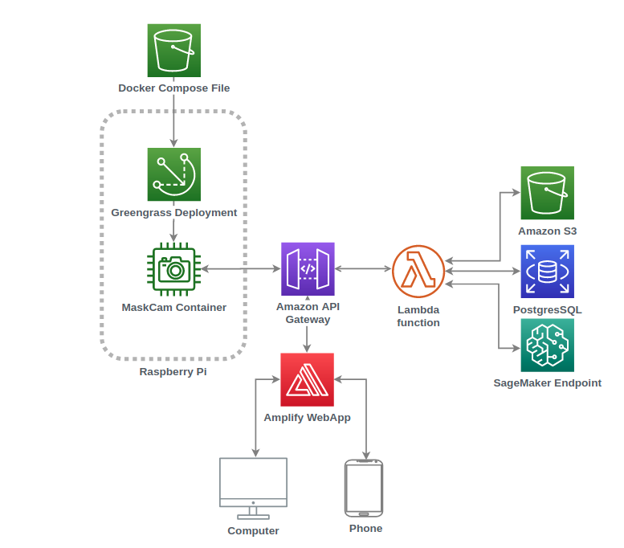
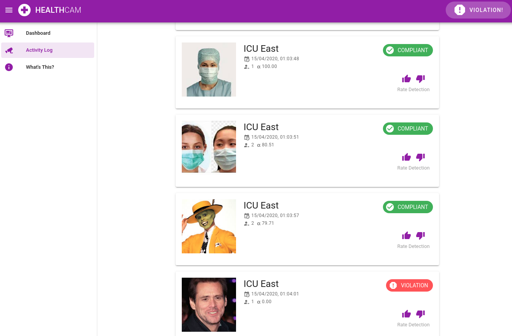
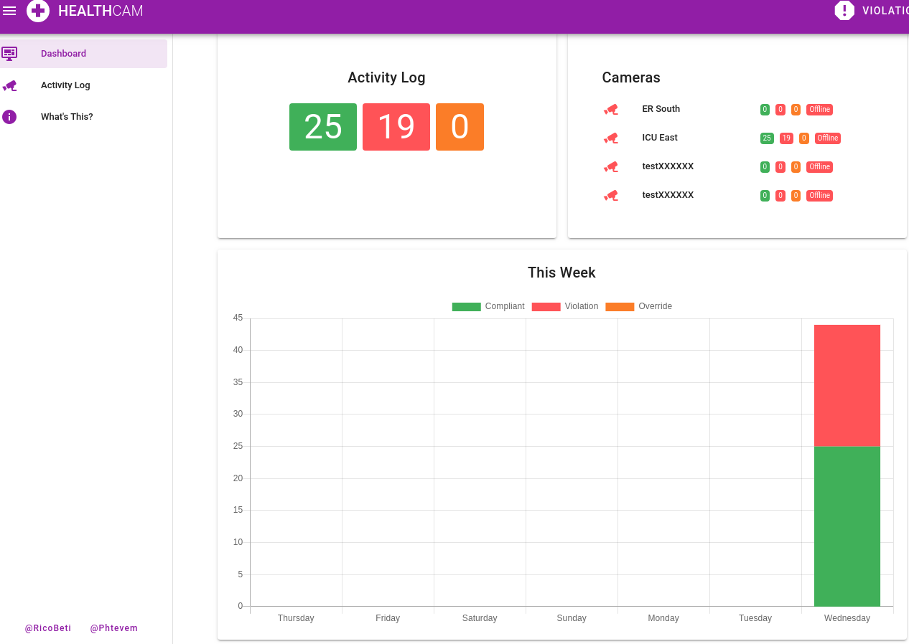
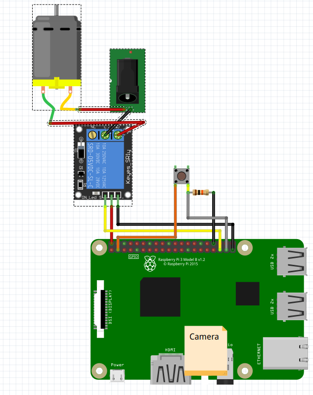
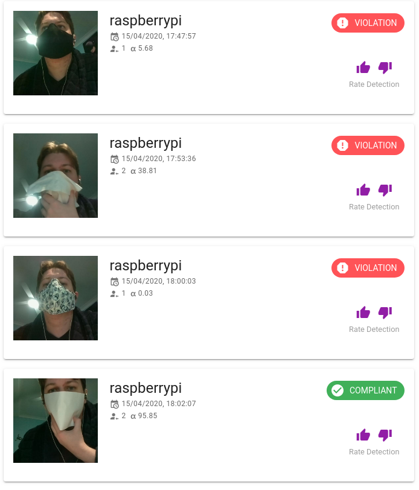
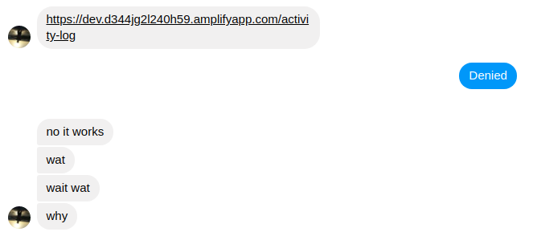

# HealthCam

## About
HealthCam is a Raspberry Pi Camera based system made using the 
[PPE Detector for Laboratory Safety](https://aws.amazon.com/marketplace/pp/prodview-b53upp27dnmzq) model provided by VITech Lab.
This model provides predictions for whether someone is wearing a mask or not, which the Raspberry Pi uses to restrict
door access to only those people that are wearing a mask.

Our submission contains two major components, the actual Raspberry Pi Camera/Lock and the accompanying website to give 
administrators access to manually flag detections as incorrect, and to view history of compliance, violation and manual 
override events.
### AWS Services Used

| Service                      | Usage                                      |
|------------------------------|--------------------------------------------|
| Greengrass                   | Remote code deployment onto Raspberry Pi   |
| API Gateway                  | Framework to publish and manage API        |
| Lambda                       | Serverless functions to perform API actions|
| Amplify                      | Framework to build web applications        |
| S3                           | Object storage                             |
| RDS                          | Hosting of a PostgresSQL database          |
| IAM                          | Management of AWS Permissions              |
| Sagemaker Models Marketplace | Model for Mask detection                   |

### Website
The website is powered by AWS Amplify, with all API calls made to AWS API Gateway. This website was used to give administrators
the ability to manually flag detections as incorrect and view a history of compliance, violation and manual 
override events.

When the Rasbperry Pi detects movement in the frame, it sends an image along with some metadata to an API gateway endpoint.
A lambda function then picks this up, and first queries a Sagemaker endpoint created with the 
[PPE Detector for Laboratory Safety](https://aws.amazon.com/marketplace/pp/prodview-b53upp27dnmzq). 
The endpoint then returns information about the number of people in frame, the probability that each item is a person, 
and the probability that they're wearing a mask. If there are people in the frame, then we take the lowest mask detected
probability, compare it to a user defined minimum probability to determine whether it's complient or not and upload image
to a S3 bucket, a reference to where that image is along with the probability and # people in frame to a RDS instance.
Finally the Lambda sends a response back for whether the door should be opened or not.

### Raspberry Pi

The Raspberry Pi system runs AWS Greengrass core. This allows the remote pushing of code and configurations through the AWS Greengrass Docker connector.
The code inside the Docker container that gets deployed continually monitors for a percentage of pixels that have changed
by some user defined percentage. If this threshold has exceded then it will send the image it has captured through to 
an AWS API Gateway endpoint, which will then do analysis on the image using the 
[PPE Detector for Laboratory Safety](https://aws.amazon.com/marketplace/pp/prodview-b53upp27dnmzq) model, to determine
whether everyone in frame is wearing a mask.

If they are wearing a mask, then the Raspberry Pi Turns a GPIO pin connected to a relay to HIGH, which will actuate the
locking mechanism.

In the event of an emergency, there is a manual override button which will trigger an interrupt, immediately opening the
door, recording a picture and tagging the event as "override".

## Bill of Materials
| Item                                                                                                                                             | Description                                |
| -------------------------------------------------------------------------------------------------------------------------------------------------|--------------------------------------------|
| [USB-C 5V 3A Power Supply](https://www.ebay.com.au/itm/Raspberry-Pi-4-4B-Power-Supply-Adapter-ON-OFF-Switch-USB-C-5V-3A-US-EU-Plug/303278828464) | Power for the Raspberry Pi                 | 
| [12V 1A Power Supply](https://www.ebay.com.au/itm/AC-100-240V-Converter-Adapter-DC-12V-1A-12W-Power-Supply-AU-Plug-Wall-Charger/401648202115)    | Power for the Lock Mechanism               |
| [Electronic Latch Lock](https://www.ebay.com.au/itm/Electronic-Latch-Lock-Catch-Door-12V-Electro-magnet-Release-Solenoid-Slant-Slug/163889580407)| Lock Mechanism for Door                    |
| [5V relay](https://www.ebay.com.au/p/902676901)                                                                                                  | Relay to isolate the lock power from the Pi| 
| [Pi Camera V2](https://www.ebay.com.au/itm/Raspberry-Pi-Camera-Board-V2/323833141585)                                                            | Camera                                     |
| [Dupont Line](https://www.ebay.com.au/itm/10-20-30CM-40PCS-Pin-Dupont-Wire-Line-Ribbon-M-F-M-M-F-F-Jumper-Cables-Arduino/274194461478)           | Wiring                                     |
| [Button](https://www.ebay.com.au/itm/10pcs-6x6x4-9mm-4pin-G89-Tactile-Push-Button-Micro-Switch-Self-Reset-Dip-Press/132693965284)                | Press button for manual override of system |
| [10KΩ Resistor](https://www.ebay.com.au/itm/10pcs-1-4-Watt-0-25W-Metal-Film-Resistors-1-Full-Range-of-Values-0-to-10M/192581889373)              | Pull down resistor for button              |

## Setup
We've written extensive documentation on how to set this up.
The repo is split into
## Lambdas

## Website

## Amplify

[1. Setup AWS CLI]
[2. Setup Model Endpoint]
[3. Setup FrontEnd]
[4. Setup Raspberry Pi]

## Challenges we ran into

### GreenGrass Setup
We wanted to drive our development and infrastructure without having to click through into the AWS UI to try to learn
how to better use the CLI and AWS SDKs. Because we hadn't used much Greengrass in the past it took us a while to properly
setup a greengrass core and drive deployments without using the AWS UI. We'd recommend checking out this 
[article](https://devopstar.com/2019/10/07/aws-iot-greengrass-cloudformation-raspberry-pi) if you're attempting greengrass and Raspberry Pi.

### IAM
We don't work with AWS a lot and we wanted to avoid our bad behaviours of the past with allow *, so learning how to properly
apply the required AWS policies to roles specific to their task was an interesting experience. We've identified a lot of
cases where we could have done a lot better, so hopefully we'll fix those up.

### OpenCV and Raspberry Pi
Some changes to OpenCV (used for detecting image differences) in November broke a few packages. Thankfully 
[Adrian Rosebrock](https://www.pyimagesearch.com/2019/09/16/install-opencv-4-on-raspberry-pi-4-and-raspbian-buster/)
has updated his blog with steps around this. In retrospect given the problems we had, it would probably have been worth
doing the pixel change detection in numpy instead of using such a heavy library to do it for us.

### Models Limitations
We learnt very late in the hackathon that the model has a slight limitation that it doesn't do very will with non
white/blueish coloured masks.

## What we learnt

### RICO PLS

## Whats next
### Authentication
Currently there is no Authentication on the API gateway or website. This is something that's probably required if anyone
is going to use this, so it would be well worth us putting in the effort to get this in. We would probably want to use 
AWS Cognitio with Federated Identities to do manage credentials.

### Cloudformation Deployments
Because we used two different frameworks (Serverless Framework and AWS Amplify) we didn't really have a single deployment pipeline.
Ideally we'd fully embrace Infrastructure as a Service and use Cloudformation to manage all of our cloud resources.

### Proper Deployment Pipleine (CICD)
One of the things that slowed us down a bit was a lack of a proper deployment pipeline which occasionally slowed us down
. We would probably want to implement proper Continous Integration/Continous Deployment to avoid us
having to push code manually and to make sure that we have some automated tests running against our code once deployed to AWS.

### Proper Bootstrap Script for Raspberry Pi
Currently the setup of the Raspberry Pi and Greengrass is a bit more complicated than it needs to be. Based on the steps,
it should be easy enough to set up a proper bootstrap script to setup the pi ready for greengrass deployments.

## Thanks
There were a few resources that we found invaluable while we were making this
* [Setting up Greengrass on a Raspberry Pi](https://devopstar.com/2019/10/07/aws-iot-greengrass-cloudformation-raspberry-pi) was a great into to Greengrass.
* [Accessing the Raspberry Pi Camera](https://www.pyimagesearch.com/2015/03/30/accessing-the-raspberry-pi-camera-with-opencv-and-python/)
had some useful tips on how to poll the Pi Camera a lot faster than I was previously polling it.
* [Install OpenCV4 on Raspberry Pi](https://www.pyimagesearch.com/2019/09/16/install-opencv-4-on-raspberry-pi-4-and-raspbian-buster/)
* [Launch RDS with AWS CLI](https://www.mydatahack.com/how-to-launch-postgres-rds-with-aws-command-line-interface-cli/)
* [raspi-config noint commands](https://github.com/l10n-tw/rc_gui/blob/master/src/rc_gui.c#L50-L100) very useful for enabling things via cli
* [AWS Docker Connector](https://docs.aws.amazon.com/greengrass/latest/developerguide/docker-app-connector.html) information on the greengrass docker connector

