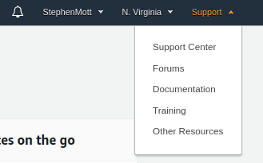

# TODO
This is most likely UI based


# Request AWS Limits
Before you'll be able to create the model you'll need to request your service limits to be increased, to allow you to
 host a ```ml.p3.2xlarge``` SageMaker hosting instance.



# Subscribe to model
Subscribe to the [PPE Detector for Worker Safety](https://aws.amazon.com/marketplace/pp/prodview-6gvzwuebead3o?ref_=_ml_hackathon)
. At time of writing there is a 30 day trial for this.


# Create required roles

#TODO create the role
aws iam create-role --role-name SagemakerRole --assume-role-policy-document '{                                                                
  "Version": "2012-10-17",
  "Statement": [
    {
      "Effect": "Allow",
      "Principal": {
        "Service": "sagemaker.amazonaws.com"
      },
      "Action": "sts:AssumeRole"
    }
  ]
}'
aws iam attach-role-policy --role-name SagemakerRole --policy-arn arn:aws:iam::aws:policy/AmazonSageMakerFullAccess
Get ARN
aws iam get-role --role-name SagemakerRole | grep Arn

export model_name=YOUR_MODEL_NAME
export endpoint_name=YOUR_ENDPOINT_NAME

# Setup Model Endpoint.
```
aws sagemaker create-model --model-name ${model_name} --execution-role-arn 'arn:aws:iam::811908451910:role/SagemakerRole' --primary-container ModelPackageName='arn:aws:sagemaker:us-east-1:865070037744:model-package/vitechlab-ppe-lab-model-v1-1-480cb3fc5bd97e9bf1e213cca498bbc4' --region us-east-1
```
save the returned arn

# Note it will need to be in the format ```^[a-zA-Z0-9](-*[a-zA-Z0-9])*```


aws sagemaker create-endpoint-config --endpoint-config-name my-endpoint --production-variants VariantName=variant-1,ModelName=${model_name},InstanceType=ml.p3.2xlarge,InitialInstanceCount=1 --region us-east-1


aws sagemaker create-endpoint --endpoint-name ${model_name} --endpoint-config-name my-endpoint --region us-east-1
```
Check endpoint
```
aws sagemaker describe-endpoint --endpoint-name ${model_name} --region us-east-1

Save your endpoint name, you'll need it later.
```
You'll need to wait until your endpoint moves from ```creating``` to ``` ```
[your subscriptions](https://aws.amazon.com/marketplace/library/)


aws sagemaker delete-endpoint --endpoint-name ${model_name} --region us-east-1


